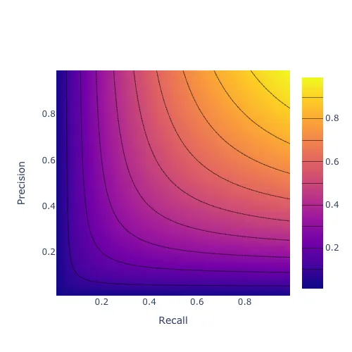

This post is part of a series on evaluating classification models:

* [**Part 1: Weighing False Positives Against False Negatives**](/posts/2019-11-14_evaluating-classifier-pt1/evaluating_classifiers_pt_1.html) explains why we need systematic ways to evaluate classification models.
* [**Part 2: The Sufficiency of Precision and Recall**](/posts/2019-11-20_evaluating-classifiers-pt2/evaluating_classifiers_pt_2.html) explains why *precision* and *recall* are sufficient for evaluating classification models in typical cases.
* [**Part 3: $F_\beta$ and Other Weighted Pythagorean Means of Precision and Recall**](/posts/2019-11-26_evaluating-classifiers-pt3/evaluating_classifiers_pt_3.html) explains what patterns of preferences are encoded by the *Pythagorean means* of precision and recall. This class of metrics includes the popular $F_\beta$ family, among others.
* [**Part 4: Weighted Power Means of Precision and Recall**](/posts/2019-12-02_evaluating-classifiers-pt4/evaluating_classifiers_pt4.html) generalizes beyond the Pythagorean means to the broader class of *weighted power means* of precision and recall.

This series differs from other discussions of evaluation metrics for classification models in that it aims to provide a **systematic perspective**. Rather than providing a laundry list of individual metrics, it situates those metrics within a fairly comprehensive family and explains how you can choose a member of that family that is appropriate for your use case.

## Classifying Products at ShopRunner

ShopRunner's mission is to power extraordinary shopping experiences that connect customers to the brands they love. **To accomplish this mission, we need to make it easy for users to find products they want.** Many of our efforts toward this end would benefit from being able to classify products within a single product taxonomy. For instance, classifying a particular product as a dress allows us to display it under "Women > Clothing > Dresses" in our District app.

**Classifying all of the products across our retailer network into a single taxonomy is challenging.** Our partners all use different product taxonomies, often including categories such as "New Arrivals" that do not map cleanly into categories like "Dresses." As a result, simple rules-based approaches based on the product categories that our partners use are not sufficient. Moreover, classifying each product manually would be too expensive: we have more than 100 partners with millions of total products, many of which turn over several times each year.

**We are using machine learning to address this challenge.** Modern deep learning systems can learn to classify products based on images and text descriptions with accuracy similar to that of manual classification for a small fraction of the cost.

## False Positives and False Negatives

Even with cutting-edge machine learning, **no classification system is perfect**. For instance, a model that classifies a product as "dress" or "not a dress" might sometimes misidentify a skirt as a dress. We would call that misclassification a **false positive** for the dress category. In addition, it might sometimes misidentify a dress as "not a dress," which we would call a **false negative** for the dress category.

**Examples:**

Many machine learning classification models actually produce a probability for a label such as dress. By default, we would typically take a model to be predicting "dress" if its probability for "dress" is at least $50\%$ and "not a dress" otherwise. But we can use a cutoff other than $50\%$ if we wish. For instance, we might only classify a product as a dress if its probability for dress is at least $70\%$.

Using $70\%$ rather than $50\%$ as our cutoff probability for a positive prediction would change our model's error rates. Specifically, by causing the model to produce fewer positives, it would reduce the false positive rate (which is good) but increase the false negative rate (which is bad). **Part of our job in developing a classification model is to choose cutoff probabilities that strike an appropriate balance between false positives and false negatives.**

For simplicity, let's pretend that our District app only sells dresses. (It doesn't!) Showing a product that isn't a dress in the app would be potentially off-putting to our users, so the cost of a false positive is significant. On the other hand, a dress that we mistakenly classify as "not a dress" typically will not have much impact as long as we still have a large number of other dresses to choose from. As a result, the cost of a single false positive is generally higher than that of a single false negative, so we should set our cutoff probability higher than $50\%$.

## Precision and Recall

We have said that we should set the cutoff probability higher than $50\%$, but how much higher? To answer this question, we need ways to quantify our model's performance as we vary the cutoff probability. There are many metrics that we could use for this purpose. **I will focus on *precision* and *recall*.** Part 2 of this series will justify that choice.

A model's **precision** is the accuracy of its positive predictions. For instance, when our model says that something is a dress, how often is it actually a dress?

$$
\text{Precision} = \frac{|\text{True Positives}|}{|\text{True Positives}| + |\text{False Positives}|}
$$

where e.g. "|True Positives|" is the number of true positive predictions that our model generates.

**Recall** is the model's accuracy on the actual positive class. For instance, when a product is actually a dress, how often does our model say that it is a dress?

$$
\text{Recall} = \frac{|\text{True Positives}|}{|\text{True Positives}| + |\text{False Negatives}|}
$$

Now suppose we build two different models, and one has better precision while the other has better recall. (We can typically create such a scenario by changing the cutoff probability for positive predictions.)

**Model A:**

|           | Predicted No | Predicted Yes | Total |
|-----------|-------------|---------------|--------|
| Actual No | 90          | 10            | 100    |
| Actual Yes| 1           | 99            | 100    |
| Total     | 91          | 109           | 200    |

$$
\text{Precision} = \frac{|\text{True Positives}|}{|\text{True Positives}| + |\text{False Positives}|} = \frac{|99|}{|99| + |10|} = 90.8\%
$$

$$
\text{Recall} = \frac{|\text{True Positives}|}{|\text{True Positives}| + |\text{False Negatives}|} = \frac{|99|}{|99| + |1|} = 99\%
$$

**Model B:**

|           | Predicted No | Predicted Yes | Total |
|-----------|-------------|---------------|--------|
| Actual No | 91          | 9             | 100    |
| Actual Yes| 3           | 97            | 100    |
| Total     | 94          | 106           | 200    |

$$
\text{Precision} = \frac{|\text{True Positives}|}{|\text{True Positives}| + |\text{False Positives}|} = \frac{|97|}{|97| + |9|} = 91.5\%
$$

$$
\text{Recall} = \frac{|\text{True Positives}|}{|\text{True Positives}| + |\text{False Negatives}|} = \frac{|97|}{|97| + |3|} = 97\%
$$

To choose between these models, we need to decide whether the gain from $90.8\%$ precision to $91.5\%$ precision that we get by going from Model A to Model B is enough to offset a loss from $99\%$ recall to $97\%$ recall.

## Why We Need a Variety of Model Evaluation Metrics

If we only had to make occasional decisions between pairs of models, then it would be reasonable to make decisions about how to trade off precision against recall on an *ad hoc* basis. However, we can typically generate dozens of models that all differ in terms of precision and recall with no model dominating all others on both measures, for instance by varying our cutoff probability. As a result, **we need a way to combine precision and recall into a single metric** that we can use to select the "best" model for a given application.

A natural way to combine precision and recall is to average them. For instance, using simple averaging in the example above, Model A would get a score of $1/2(90.8\% + 99\%) = 94.9\%$, while Model B would get a score of $1/2(91.5\% + 97\%) = 94.3\%$. However, this simple mean gives equal weight to precision and recall. We have said that it is more important to avoid showing non-dresses in our app than it is to show all of the dresses that we have, so precision is more important to us than recall. Thus, **a simple arithmetic mean of precision and recall isn't the right choice in this application. We should use a weighted average instead.**

Moreover, perhaps we would be willing to give up one point of precision in exchange for one point of recall if precision were very high (say $99%$) and recall were very low (say $10%$), whereas if precision and recall were similar then we would not be willing to make that trade. If so, then a weighted *arithmetic* mean of precision and recall is not the right choice, because a weighted arithmetic mean encodes a willingness to trade one point of recall for a fixed number of points of precision at every level of precision and recall.

In that case, **we might consider using something like a weighted geometric or harmonic mean rather than a weighted arithmetic mean.** Part 3 of this series discusses those options.

There are many ways to weigh precision against recall, and which way is most appropriate depends on the problem. Many sources help with the challenge of choosing an evaluation metric for a given problem by providing a laundry list of metrics with a few comments about the characteristics of each one. **This series of blog posts aims to provide a more systematic perspective.** It culminates in a new family of metrics that generalizes the popular $F_\beta$ score. This family allows the user to specify not only the overall importance of recall relative to precision but also how that relative importance shifts as recall and precision become increasingly imbalanced.

## Appendix

### Extending Binary Model Evaluation Metrics to Multiclass Problems

So far we have discussed only binary classification problems, such as identifying whether a particular product is or is not a dress. The full problem of placing products within our taxonomy is not a binary classification problem, because there are many possible categories for each item. For instance, we need to say not just whether a given item is a dress or not, but also if it is not a dress, whether it is a skirt, a pair of jeans, and so on. However, **we can regard this multiclass problem as a *set* of binary classification problems (one for each category) and aggregate performance on each of those subproblems to produce an overall measure of model performance**. As a result, the discussion in these blog posts is relevant to evaluating multiclass models even though it focuses on binary models.

For instance, here is one possible procedure:

* Calculate precision and recall for the "dress" category
* Calculate an overall score for the "dress" category by averaging those precision and recall values in one of the ways we will discuss.
* Do likewise for all other categories.
* Use a simple average of the individual category scores as the score for the multiclass model as a whole.

See the [scikit-learn documentation](https://scikit-learn.org/stable/modules/model_evaluation.html#from-binary-to-multiclass-and-multilabel) for a discussion of several ways to produce multiclass model evaluation metrics from binary model evaluation metrics.

### Using a Single Evaluation Metric

It is common to use *multiple* metrics to measure *various aspects of model performance* separately. In my view, this approach is helpful for **diagnostic purposes** — that is, for figuring out where your model is failing and using that information to guide model development. However, **it is best to use but one metric for evaluation purposes** — that is, for deciding which of a set of models is best and whether it is better than no model.

This single evaluation metric can be different for different projects, and it is subject to revision within a project, but for a given project there should be one primary metric at any given time that is used to guide modeling decisions. This approach allows a team developing the model to iterate quickly, without getting bogged down in long discussions about how to weigh different aspects of model performance against one another at every turn. See [this lecture from Andrew Ng's "Structuring Machine Learning Projects" course](https://www.coursera.org/lecture/machine-learning-projects/single-number-evaluation-metric-wIKkC) for more discussion of this issue.

## Acknowledgements

Thanks to Nicole Carlson, Ali Vanderveld, and the rest of the ShopRunner data science team for comments on earlier versions of this material.

*Originally published at [medium.com](https://medium.com/@gsganden/evaluating-classification-models-1-ff0730801f17)*
