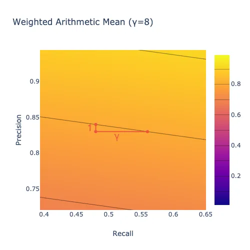

This post is part of a series on evaluating classification models:

* [**Part 1: Weighing False Positives Against False Negatives**](/posts/2019-11-14_evaluating-classifier-pt1/evaluating_classifiers_pt_1.html) explains why we need systematic ways to evaluate classification models.
* [**Part 2: The Sufficiency of Precision and Recall**](/posts/2019-11-20_evaluating-classifiers-pt2/evaluating_classifiers_pt_2.html) explains why *precision* and *recall* are sufficient for evaluating classification models in typical cases.
* [**Part 3: $F_\beta$ and Other Weighted Pythagorean Means of Precision and Recall**](/posts/2019-11-26_evaluating-classifiers-pt3/evaluating_classifiers_pt_3.html) explains what patterns of preferences are encoded by the *Pythagorean means* of precision and recall. This class of metrics includes the popular $F_\beta$ family, among others.
* [**Part 4: Weighted Power Means of Precision and Recall**](/posts/2019-12-02_evaluating-classifiers-pt4/evaluating_classifiers_pt_4.html) generalizes beyond the Pythagorean means to the broader class of *weighted power means* of precision and recall.

This series differs from other discussions of evaluation metrics for classification models in that it aims to provide a **systematic perspective**. Rather than providing a laundry list of individual metrics, it situates those metrics within a fairly comprehensive family and explains how you can choose a member of that family that is appropriate for your use case.

This post explains how the three weighted "Pythagorean means" (arithmetic, geometric, and harmonic) of precision and recall encode preferences over models. 

# An Example

Suppose we build two different models, and one has better precision while the other has better recall.

**Model A**:

|           | Predicted No | Predicted Yes | Total |
|-----------|-------------|---------------|--------|
| Actual No | 90          | 10            | 100    |
| Actual Yes| 1           | 99            | 100    |
| Total     | 91          | 109           | 200    |

$$
\text{Precision} = \frac{|\text{True Positive}|}{|\text{True Positive}| + |\text{False Positive}|} = \frac{90}{99 + 10} = 90.8\%
$$

$$
\text{Recall} = \frac{|\text{True Positive}|}{|\text{True Positive}| + |\text{False Negative}|} = \frac{99}{99 + 1} = 99.0\%
$$

**Model B**:

|           | Predicted No | Predicted Yes | Total |
|-----------|-------------|---------------|--------|
| Actual No | 91          | 9             | 100    |
| Actual Yes| 3           | 97            | 100    |
| Total     | 94          | 106           | 200    |

$$
\text{Precision} = \frac{|\text{True Positive}|}{|\text{True Positive}| + |\text{False Positive}|} = \frac{91}{91 + 9} = 91.5\%
$$

$$
\text{Recall} = \frac{|\text{True Positive}|}{|\text{True Positive}| + |\text{False Negative}|} = \frac{97}{97 + 3} = 97.0\%
$$

To choose between these models, we need to decide whether the gain from $90.8\%$ precision to $91.5\%$ precision that we get by going from Model A to Model B is enough to offset a loss from $99\%$ recall to $97\%$ recall. **We need some way to combine precision and recall into a single evaluation metric.**

# The Weighted Arithmetic Mean $A_\gamma$

When considering how to combine precision and recall to produce an overall evaluation metric, a natural first thought is simply to average them:

$$
\text{Simple Arithmetic Mean}: \frac{1}{2}(P + R)
$$

where $P$ is precision and $R$ is recall.

In the scenario above, going from Model A to Model B increases precision by $0.7\%$ but decreases recall by $2.0\%$. A simple arithmetic mean of precision and recall would tell us not to make this trade. It implies that we are willing to trade a decrease of $2.0\%$ in recall only for an increase of $2.0\%$ or more in precision. More generally, **a simple arithmetic mean says that we are willing to trade one unit of recall only for one or more units of precision, and vice versa, regardless of the current precision and recall.**

We can visualize this pattern of preferences using a set of "level curves." In this plot, the simple arithmetic mean would tell us that two models that fall on the same curve are equally good, and that a model that lies on a curve up and to the right of another model is better than that other model.

<iframe src="plots/simple_arithmetic_mean_curves.html" width="100%" height="550" frameborder="0"></iframe>

Another possible pattern of preferences is to be just willing to trade one unit of precision for $\gamma$ units of recall for some $\gamma > 0$. This pattern is captured by a weighted arithmetic mean:

$$
\text{Weighted Arithmetic Mean} (\gamma): \frac{1}{1 + \gamma}\left(\gamma P + R\right)
$$

The level curves for this pattern of preferences are straight lines with slope $-\gamma$:

<iframe src="plots/weighted_arithmetic_mean_curves.html" width="100%" height="550" frameborder="0"></iframe>

To help wrap your head around how to read the plot above, move the slider all the way to the right ($\gamma=8$). Observe that the level curves become nearly horizontal. Pick a point on one of the lines, such as ($x=.48$, $y=.84$), shown up close below. That point represents a model with $48\%$ recall and $84\%$ precision. If that model lost one percentage point of precision (corresponding to a shift down one unit to $y=.83$), it would have to gain $\gamma=8$ points of recall (corresponding to a shift right eight units to $x=.56$) to get back to the level curve it started on. In other words, **the plot says that we would require 8 units of recall in order to give up one unit of precision, indicating that we care much more about precision than recall.**

# The Weighted Harmonic Mean $F_\beta$

**In some cases, the arithmetic mean is inappropriate because the amount of recall we would require in order to give up one unit of precision is not fixed;** instead, it depends on the current recall and precision values. One option in those cases is to use a weighted *harmonic* mean of precision and recall instead of a weighted arithmetic. The result is the popular $F_\beta$ score.

The weighted harmonic mean is the inverse of the arithmetic mean of the inverses:

$$
\text{Weighted Harmonic Mean} (\gamma): \left(\frac{1}{1 + \gamma}\left(\gamma P^{-1} + R^{-1}\right)\right)^{-1}
$$

It is convenient to use the parameter $\beta$ such that $\beta^2 = \frac{1}{\gamma}$ in place of $\gamma$, which results in the following equivalent expression:

$$
\text{Weighted Harmonic Mean} (\beta): \left(\frac{1}{1 + \beta^2}\left(P^{-1} + \beta^2R^{-1}\right)\right)^{-1}
$$

With a weighted arithmetic mean $A_\gamma$, the relative importance of precision and recall is fixed: that metric says that we are willing to trade one unit of precision for $\gamma$ or more units of recall *regardless of the current precision and recall*. **With a weighted harmonic mean $F_\beta$, by contrast, the relative importance of precision and recall depends on their current values.** For instance, suppose that recall is $80\%$. If precision is $98\%$, then you might value a $1\%$ increase in recall more than a $1\%$ increase in precision, whereas if precision is $10\%$, then you might care more about increasing precision.

A metric that places more importance on recall when recall is low compared to precision and vice versa has level curves that curve upward:

<iframe src="plots/weighted_harmonic_mean_curves.html" width="100%" height="550" frameborder="0"></iframe>

One way to think about the harmonic mean is that **it deviates from the arithmetic mean in the direction of the minimum**, as we will see more clearly when we discuss weighted power means in the next post in this series. The weighted harmonic mean of a set of numbers with a given weighting $\gamma$ is always less than the arithmetic mean with the same $\gamma$ (unless all of the numbers are the same, in which case the arithmetic and harmonic means are equal.)

One benefit of using $\beta$ instead of $\gamma$ is that **$\beta$ indicates how much we care about recall relative to precision**. More precisely, $\beta$ is the ratio of recall to precision where the harmonic mean places equal value on a one-unit increase in recall and a one-unit increase in precision (in the limit as the size of the unit goes to zero). **If recall is more important to you than precision, for instance, then you would set $\beta$ greater than one** because you would rather have a one-unit increase in recall than a one-unit increase in precision unless recall is already high compared to precision.

For instance, $\beta=3$ means that if precision is $25\%$, then you would rather have one more unit of precision than one more unit of recall if recall is above $75\%$, but you would rather have the recall if recall is below $75\%$ (because $75\%/25\%=3$).

**You narrow down the range of $\beta$ values that are appropriate for a particular application by getting stakeholder feedback on different combinations of precision and recall values.** For instance, at one point we had a model at ShopRunner that we had tuned for $F_\beta$ with $\beta=.3$, meaning that we cared about recall about $30\%$ as much as we cared about precision. That model classified products with $90\%$ precision and $36\%$ recall. When we showed those results to our primary stakeholder, she expressed more concern about the $36\%$ recall than the $90\%$ precision. **Assuming that $F_\beta$ captured the overall shape of her preferences, this feedback entailed that her $\beta$ was greater than $36\%/90\%=.4$.** After further discussion, we started tuning for $F_\beta$ with $\beta=.5$ instead of $.3$.

In the plot below, the thick black line indicates the set of models where you would be equally happy with one more point of precision or one more point of recall. Above the line, you would rather have one point of recall. Below the line, you would rather have one point of precision. Larger values of $\beta$ mean that you care more about recall overall, so there is more area below the line.

<iframe src="plots/weighted_harmonic_mean_curves_w_line.html" width="100%" height="550" frameborder="0"></iframe>

In these plots, the number of units of recall that you require in exchange for one unit of precision when recall is $R$ and precision is $P$ is given by the slope of the tangent line to the level curve that passes through ($x=R, y=P$). For instance, move the slider all the way to the right ($\beta=8$). Exactly on the black line, the tangent to each level curve has slope $-1/1$, indicating that you would exchange one unit of precision for one unit of recall, as shown below.

Below the black line, where precision is high compared to recall, the tangent to each level curve has slope $-1/\delta$ for some $\delta>1$, indicating that you would require more than one unit of recall in exchange for one unit of precision, as shown below. In other words, with a harmonic mean, when precision is high enough compared to recall, you care about improving recall more than you care about improving precision. This region of the plot is large in this case because $\beta>1$, indicating that we care about recall more than precision overall.

Above the black line, where recall is high compared to precision, the tangent to each level curve has slope $-1/\delta$ for some $\delta<1$, indicating that you would require less than one unit of recall in exchange for one unit of precision, as shown below. In other words, with a harmonic mean, when recall is high enough compared to precision, you care about improving precision more than you care about improving recall. This region of the plot is small in this case because $\beta>1$, indicating that we care about recall more than precision overall.

For the arithmetic mean, unlike the harmonic mean just discussed, the level curves are straight lines. As a result, the tangent to a level curve is just the level curve itself. Moreover, all of the level curves have the same slope $-1/\gamma$, corresponding to the fact that with an arithmetic mean you are willing to trade one unit of precision for $\gamma$ or more units of recall for every level of precision and recall.

# Why Would You Use a Non-Arithmetic Mean?

You might wonder whether a harmonic mean of precision and recall is ever appropriate. The author of an [excellent recent blog post](https://druce.ai/2019/10/understanding-classification-thresholds-using-isocurves) suggested that it isn't, writing that they had "never encountered a business problem where a real-life cost function of false positives and false negatives is a harmonic mean." I claim on the contrary that **a harmonic mean or something similar is often appropriate, in scenarios where the value of the algorithm depends on the *overall impression* created by its outputs** rather than on separate effects of its individual predictions.

**An arithmetic mean tends to be appropriate for diagnostic problems.** For instance, in medical testing a false positive can cause unnecessary stress and expense, while a false negative can cause worse health outcomes because of a missed opportunity at early intervention. To a first approximation, those costs are specific to each patient and do not depend on how many other false positives or false negatives the test generates. As a result, we should be willing to trade precision for recall at the same rate regardless of the current precision and recall, which makes an arithmetic mean appropriate.

**By contrast, a harmonic mean tends to be appropriate for information retrieval problems.** For instance, consider the model we discussed in Part 1 of this series that identifies whether a product is a dress or not for an app that sells dresses. Suppose that the pool of products being classified is enormous — every dress for sale on the internet, if you like. Then if recall is quite high, say $98\%$, then another point of recall doesn't mean much: someone who is looking for a dress will already be able to find one that they love. If precision is low in this scenario, then it would be better to focus on improving precision. Whereas if precision is very high, say $98\%$, then encountering a product that should not be in the app because it is not a dress is a rare experience that users will plausibly overlook. If recall is low in that scenario, so that users are not always able to find the perfect dress even though it is out there somewhere, then it would be better to focus on recall. **An arithmetic mean cannot capture this pattern of preferences, while a harmonic mean can.**

**That being said, a harmonic mean is not the only option that captures this general pattern of preferences.** For instance, a **geometric mean** also puts more weight on precision or recall the lower it is, but to a smaller degree than a harmonic mean.

# The Weighted Geometric Mean $G_\gamma$

**The geometric mean is intermediate between the harmonic mean and the arithmetic mean:** unless all of the inputs are equal, a weighted geometric mean is strictly greater than the corresponding weighted harmonic mean and strictly less than the corresponding arithmetic mean. (If the inputs are all equal, then all three means are equal to their common value.)

The simple geometric mean of two numbers can be calculated by multiplying them and then taking the square root of the result:

$$
\text{Simple Geometric Mean}: \left(PR\right)^{1/2}
$$

We can incorporate weights by taking precision to the power $\gamma$ before multiplying and taking the result to the power $1/(1+\gamma)$:

$$
\text{Weighted Geometric Mean} (\gamma): \left(P^\gamma R\right)^{1/(1+\gamma)}
$$

We can change this expression so that the parameter that controls the weighting has the same interpretation as $\beta$ in the weighted harmonic mean $F_\beta$. We will use the same parameter name "$\beta$," but in this case $\beta=1/\gamma$:

$$
\text{Weighted Geometric Mean} (\beta): \left(P R^\beta\right)^{1/(1+\beta)}
$$

Here again $\beta$ is the ratio of recall to precision at which the metric responds equally to an increase in precision and an increase in recall, so that higher $\beta$ corresponds to placing more importance on recall relative to precision.

The level curves for the weighted geometric mean curve upward like those for the weighted harmonic mean, but to a smaller degree:

<iframe src="plots/weighted_geometric_mean_curves.html" width="100%" height="550" frameborder="0"></iframe>

The weighted geometric mean deviates from the weighted arithmetic mean in the direction of the minimum, again like the harmonic mean but to a smaller degree.

# Which Mean Should You Use?

When each false positive or false negative has roughly the same expected cost regardless of how many false positives or false negatives the model generates overall, you should use an arithmetic mean of precision and recall to evaluate a model. Models used for medical diagnosis often have this property.

But when what matters is the **overall impression** that the model's outputs create, you might use something like a geometric or harmonic mean that prioritizes whichever of precision or recall is lagging behind. Models used for information retrieval often have this property.

Subsequent posts in this series will situate the arithmetic, geometric, and harmonic means within a larger family of metrics and provide additional guidance on how to choose among them.

# Acknowledgements

Thanks to Nicole Carlson, Morgan Cundiff, and the rest of the ShopRunner data science team for comments on earlier versions of this material.